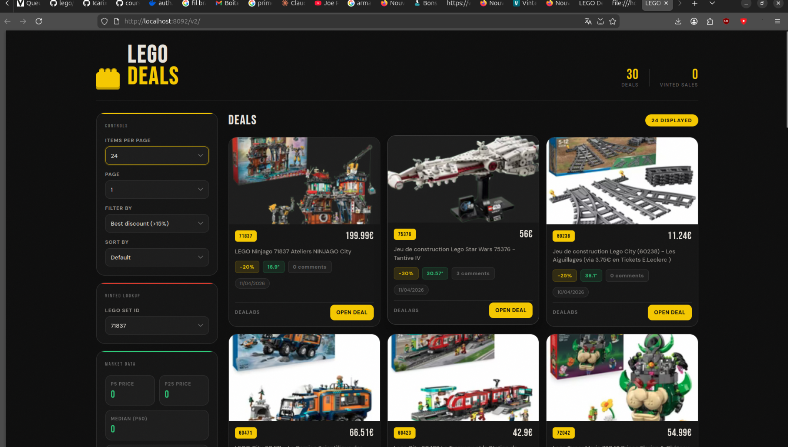
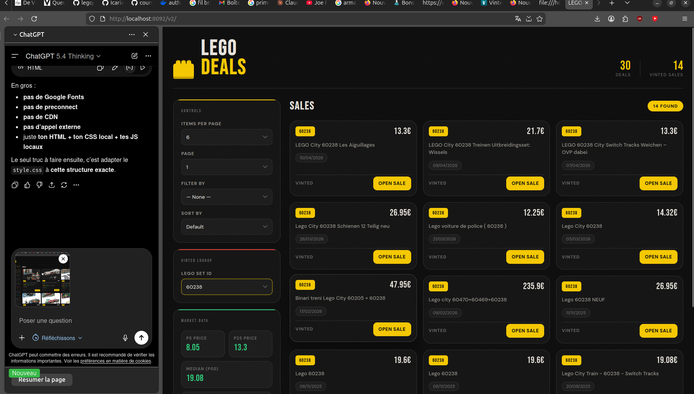

# README professeur

Bonjour,

Je mets ici quelques explications simples sur mon projet, avec quelques captures d'écran, au cas où jamais il y aurait un petit problème au lancement sur votre machine.

Je préfère préciser aussi que je m'excuse pour ne pas avoir réussi à faire le déploiement sur la solution de déploiement demandée. J'ai essayé, mais certaines fonctionnalités ne fonctionnaient pas correctement une fois dans ce cadre, donc j'ai préféré laisser une version locale qui fonctionne normalement mieux.

---

## 1. Idée générale du projet

Le projet a pour but de récupérer des informations sur des sets LEGO depuis Internet, puis de les afficher dans une interface web.

Il y a en gros deux parties principales :

- une partie de scraping / récupération de données depuis des sites web ;
- une partie API + interface pour afficher les deals et les ventes.

---

## 2. Première étape : scraping d'un site de type Dealabs

Dans un premier temps, j'ai travaillé sur le scraping d'un site de type Dealabs, pour récupérer des offres LEGO.

Capture d'écran correspondante :



---

## 3. Deuxième étape : scraping Internet pour récupérer des ventes

Dans un deuxième temps, j'ai aussi fait de la récupération de données depuis Internet pour retrouver des ventes liées à un identifiant LEGO, ici avec le script qui interroge la source utilisée pour les ventes.


## 4. Capture de secours du site

Je mets aussi ce screen au cas où le site ne fonctionnerait pas directement chez vous, notamment à cause du cookie. Normalement il fonctionne, mais je préfère mettre cette image en backup, juste pour montrer le layout et l'apparence générale du rendu.



---

## 5. Lancement du projet

### Pour lancer le site

Il faut se placer dans le dossier `server`, puis lancer :

```bash
node sandbox_v2.js https://www.dealabs.com/groupe/lego
```

Ensuite, il faut ouvrir le site dans le navigateur (par exemple Google Chrome / Google) à l'adresse locale affichée.

### Pour lancer l'API

Il faut lancer :

```bash
node api.js
```

---

## 6. À propos du cookie

Si jamais le cookie ne marche pas, il peut être nécessaire de le changer / de le remplacer dans le code avec une valeur valide.

Je préfère le préciser car selon la machine, la session, ou le moment du test, cette partie peut demander une petite remise à jour.

---

## 7. Petite précision finale

Je m'excuse encore pour le fait de ne pas avoir pu faire un déploiement propre sur la plateforme demandée.

j'ai eu pas mal de pb avec les fonction boot notamment qui ne se lancent
